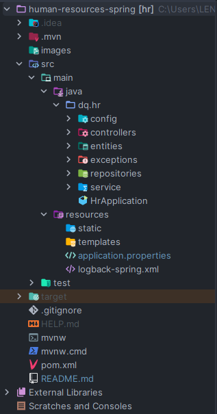
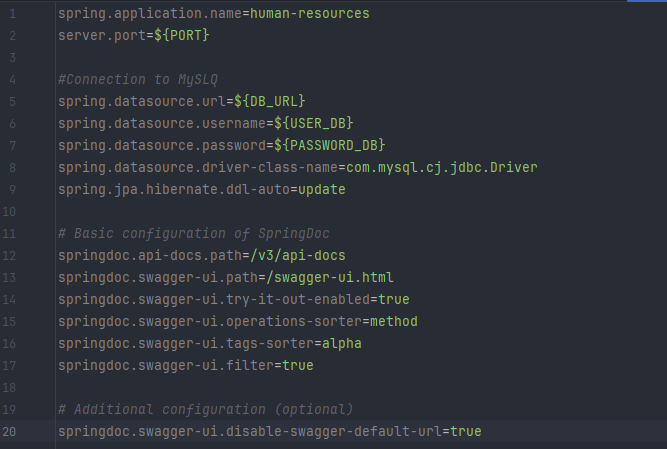

# 📌Human Resources System

A REST API designed to manage employees in the Human Resources area, built with 
Java (Maven) and Spring Boot following a clean layered architecture. 
It provides endpoints to create, read, update, and delete (CRUD) employee records, 
ensuring data persistence with MySQL.

## 🚀Features

- CRUD to employees (create, read, update, delete).
- Persistence with MySQL and JPA.
- Architecture by layers.
- Exposure of REST endpoints with Spring Boot.
- Swagger documentation.

## 🛠️Tools used

* 

   

*  

   

* 

   

* 

   

* 

   

## 📂Project Architecture

## ⚙️Installation and execution
1) Clone the repository ➜ 
`git clone https://github.com/DahierQuintero/human-resources-backend.git`
2) Set the environment variables in `application.properties` for connect to database

3) Run the `Start butom` application in your IDE (Intellij IDEA is recommended)

## 🔗Primary endpoints
| Method | Endpoint                  | Description                 |
|--------|---------------------------|-----------------------------|
| GET    | /api/v1/hr/employees/     | Return all employees        |
| GET    | /api/v1/hr/employees/{id} | Return an employee by ID    |
| POST   | /api/v1/hr/employees/     | Create a new employee       |
| PUT    | /api/v1/hr/employees/{id} | Update an existing employee |
| DELETE | /api/v1/hr/employees/{id} | Delete an employee by ID    |

## 📖Swagger Documentation
Once the service is up and running, go to:  
👉 `http://localhost:{YOUR_PORT}/swagger-ui.html`

## 📬Contact
👨‍💻 Dilan Dahier Quintero Rivera  
📩 [LinkedIn](https://www.linkedin.com/in/dilandahierquinteror-backend-developer/)